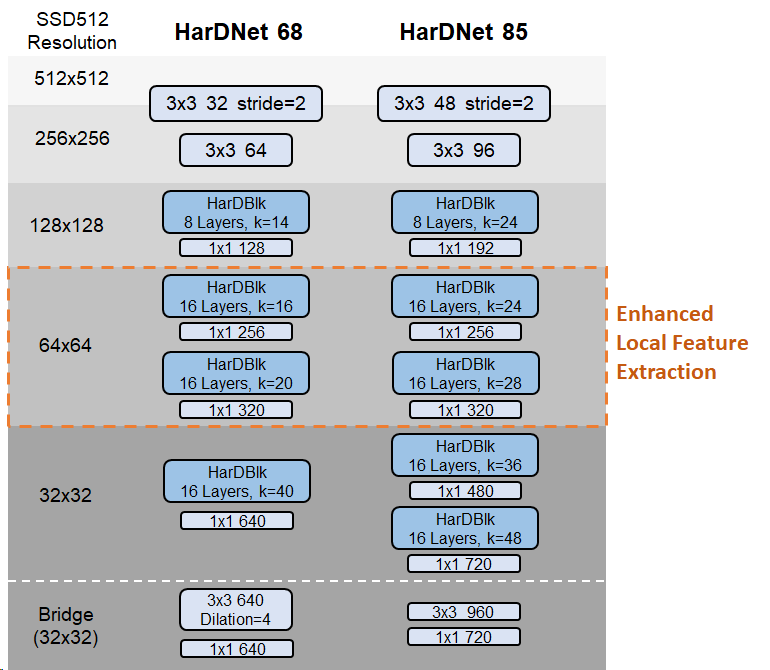

# Pytorch SSD-HarDNet
### [Harmonic DenseNet: A low memory traffic network (ICCV 2019)](https://arxiv.org/abs/1909.00948)
### Refer to [Pytorch-HarDNet](https://github.com/PingoLH/Pytorch-HarDNet) for more information

HarDNet68/85: \
With enhanced feature extraction on high resolution feature maps, the performance on object detection can be better than models designed for image classification which generally concentrate on global feature extraction.
<p align="center">
  
</p>


## Results
| Method | COCO mAP on test-dev | Inference Time |
| :---: |  :---:  |  :---:  | 
| SSD512-VGG16  | 28.8 |  15.7ms  |
| SSD513-ResNet101 | 31.2 | - |
| **SSD512-HarDNet68**   | **31.7** | 12.9ms |
| **SSD512-HarDNet85**   | **35.1** | 15.8ms |
| **RFBNet512-HarDNet68**   | **33.9** | 16.7ms |
| **RFBNet512-HarDNet85**   | **36.8** | 19.3ms |

Note: Inference time results were measured on a Titan V with pytorch 1.0.1 for detection only (NMS time was NOT included, which is 13~18ms in general cases). You might notice that HarDNet85 should be 28% faster than VGG-16 according to our [measurement](https://github.com/PingoLH/Pytorch-HarDNet) for ImageNet models. However, HarDNet still suffers from the explicit tensor copy for concatenations, such that the inference time reduction for a smaller image size (512x512) could be diminished more than for a larger image size (1024x1024 for the ImageNet model measurement).

SSD512-HarDNet68 detailed results:
```
overall performance
 Average Precision  (AP) @[ IoU=0.50:0.95 | area=   all | maxDets=100 ] = 0.317
 Average Precision  (AP) @[ IoU=0.50      | area=   all | maxDets=100 ] = 0.510
 Average Precision  (AP) @[ IoU=0.75      | area=   all | maxDets=100 ] = 0.338
 Average Precision  (AP) @[ IoU=0.50:0.95 | area= small | maxDets=100 ] = 0.125
 Average Precision  (AP) @[ IoU=0.50:0.95 | area=medium | maxDets=100 ] = 0.351
 Average Precision  (AP) @[ IoU=0.50:0.95 | area= large | maxDets=100 ] = 0.479
 Average Recall     (AR) @[ IoU=0.50:0.95 | area=   all | maxDets=  1 ] = 0.277
 Average Recall     (AR) @[ IoU=0.50:0.95 | area=   all | maxDets= 10 ] = 0.419
 Average Recall     (AR) @[ IoU=0.50:0.95 | area=   all | maxDets=100 ] = 0.439
 Average Recall     (AR) @[ IoU=0.50:0.95 | area= small | maxDets=100 ] = 0.184
 Average Recall     (AR) @[ IoU=0.50:0.95 | area=medium | maxDets=100 ] = 0.485
 Average Recall     (AR) @[ IoU=0.50:0.95 | area= large | maxDets=100 ] = 0.636
```


SSD512-HarDNet85 detailed results:
```
overall performance
 Average Precision  (AP) @[ IoU=0.50:0.95 | area=   all | maxDets=100 ] = 0.351
 Average Precision  (AP) @[ IoU=0.50      | area=   all | maxDets=100 ] = 0.548
 Average Precision  (AP) @[ IoU=0.75      | area=   all | maxDets=100 ] = 0.376
 Average Precision  (AP) @[ IoU=0.50:0.95 | area= small | maxDets=100 ] = 0.150
 Average Precision  (AP) @[ IoU=0.50:0.95 | area=medium | maxDets=100 ] = 0.389
 Average Precision  (AP) @[ IoU=0.50:0.95 | area= large | maxDets=100 ] = 0.515
 Average Recall     (AR) @[ IoU=0.50:0.95 | area=   all | maxDets=  1 ] = 0.301
 Average Recall     (AR) @[ IoU=0.50:0.95 | area=   all | maxDets= 10 ] = 0.454
 Average Recall     (AR) @[ IoU=0.50:0.95 | area=   all | maxDets=100 ] = 0.475
 Average Recall     (AR) @[ IoU=0.50:0.95 | area= small | maxDets=100 ] = 0.217
 Average Recall     (AR) @[ IoU=0.50:0.95 | area=medium | maxDets=100 ] = 0.528
 Average Recall     (AR) @[ IoU=0.50:0.95 | area= large | maxDets=100 ] = 0.673
 ```

RFBNet512-HarDNet68 detailed results:
```
overall performance
 Average Precision  (AP) @[ IoU=0.50:0.95 | area=   all | maxDets=100 ] = 0.339
 Average Precision  (AP) @[ IoU=0.50      | area=   all | maxDets=100 ] = 0.543
 Average Precision  (AP) @[ IoU=0.75      | area=   all | maxDets=100 ] = 0.362
 Average Precision  (AP) @[ IoU=0.50:0.95 | area= small | maxDets=100 ] = 0.147
 Average Precision  (AP) @[ IoU=0.50:0.95 | area=medium | maxDets=100 ] = 0.366
 Average Precision  (AP) @[ IoU=0.50:0.95 | area= large | maxDets=100 ] = 0.505
 Average Recall     (AR) @[ IoU=0.50:0.95 | area=   all | maxDets=  1 ] = 0.292
 Average Recall     (AR) @[ IoU=0.50:0.95 | area=   all | maxDets= 10 ] = 0.444
 Average Recall     (AR) @[ IoU=0.50:0.95 | area=   all | maxDets=100 ] = 0.468
 Average Recall     (AR) @[ IoU=0.50:0.95 | area= small | maxDets=100 ] = 0.233
 Average Recall     (AR) @[ IoU=0.50:0.95 | area=medium | maxDets=100 ] = 0.500
 Average Recall     (AR) @[ IoU=0.50:0.95 | area= large | maxDets=100 ] = 0.664
 ```
 
 RFBNet512-HarDNet85 detailed results:
```
overall performance
 Average Precision  (AP) @[ IoU=0.50:0.95 | area=   all | maxDets=100 ] = 0.368
 Average Precision  (AP) @[ IoU=0.50      | area=   all | maxDets=100 ] = 0.571
 Average Precision  (AP) @[ IoU=0.75      | area=   all | maxDets=100 ] = 0.395
 Average Precision  (AP) @[ IoU=0.50:0.95 | area= small | maxDets=100 ] = 0.169
 Average Precision  (AP) @[ IoU=0.50:0.95 | area=medium | maxDets=100 ] = 0.405
 Average Precision  (AP) @[ IoU=0.50:0.95 | area= large | maxDets=100 ] = 0.529
 Average Recall     (AR) @[ IoU=0.50:0.95 | area=   all | maxDets=  1 ] = 0.309
 Average Recall     (AR) @[ IoU=0.50:0.95 | area=   all | maxDets= 10 ] = 0.474
 Average Recall     (AR) @[ IoU=0.50:0.95 | area=   all | maxDets=100 ] = 0.498
 Average Recall     (AR) @[ IoU=0.50:0.95 | area= small | maxDets=100 ] = 0.259
 Average Recall     (AR) @[ IoU=0.50:0.95 | area=medium | maxDets=100 ] = 0.543
 Average Recall     (AR) @[ IoU=0.50:0.95 | area= large | maxDets=100 ] = 0.688
 ```

## Installation
- Install [PyTorch 0.2.0 - 0.4.1](http://pytorch.org/) by selecting your environment on the website and running the appropriate command.
- Clone this repository. This repository is forked from [PytorchSSD](https://github.com/lzx1413/PytorchSSD),
- Compile the nms and coco tools: (The nms utilities need to be compiled with an old version of Pytorch. After compile, you can upgrade Pytorch to the newest version)
```Shell
./make.sh
```
Note*: Check you GPU architecture support in utils/build.py, line 131. Default is:

``` 
'nvcc': ['-arch=sm_52',
```
- Then download the dataset by following the [instructions](#download-voc2007-trainval--test) below and install opencv. 
```Shell
conda install opencv
```
Note: For training, we currently  support [VOC](http://host.robots.ox.ac.uk/pascal/VOC/) and [COCO](http://mscoco.org/). 

## Datasets
To make things easy, we provide simple VOC and COCO dataset loader that inherits `torch.utils.data.Dataset` making it fully compatible with the `torchvision.datasets` [API](http://pytorch.org/docs/torchvision/datasets.html).

### VOC Dataset
##### Download VOC2007 trainval & test

```Shell
# specify a directory for dataset to be downloaded into, else default is ~/data/
sh data/scripts/VOC2007.sh # <directory>
```

##### Download VOC2012 trainval

```Shell
# specify a directory for dataset to be downloaded into, else default is ~/data/
sh data/scripts/VOC2012.sh # <directory>
```
### COCO Dataset
Install the MS COCO dataset at /path/to/coco from [official website](http://mscoco.org/), default is ~/data/COCO. Following the [instructions](https://github.com/rbgirshick/py-faster-rcnn/blob/77b773655505599b94fd8f3f9928dbf1a9a776c7/data/README.md) to prepare *minival2014* and *valminusminival2014* annotations. All label files (.json) should be under the COCO/annotations/ folder. It should have this basic structure
```Shell
$COCO/
$COCO/cache/
$COCO/annotations/
$COCO/images/
$COCO/images/test2015/
$COCO/images/train2014/
$COCO/images/val2014/
```
*UPDATE*: The current COCO dataset has released new *train2017* and *val2017* sets which are just new splits of the same image sets. 

## Testing
```
python train_test.py -v SSD_HarDNet68 -s 512 --test <path_to_pretrained_weight.pth>
```

## Pretrained Weights
- Pretrained backbone models: 
[hardnet68_base_bridge.pth](https://ping-chao.com/hardnet/hardnet68_base_bridge.pth) | 
[hardnet85_base.pth](https://ping-chao.com/hardnet/hardnet85_base.pth) 
- Pretrained models for COCO dataset:
[SSD512-HarDNet68](https://ping-chao.com/hardnet/SSD512_HarDNet68_COCO.pth) | 
[SSD512-HarDNet85](https://ping-chao.com/hardnet/SSD512_HarDNet85_COCO.pth) | 
[RFBNet512-HarDNet68](https://ping-chao.com/hardnet/RFB512_HarDNet68_COCO.pth) | 
[RFBNet512-HarDNet85](https://ping-chao.com/hardnet/RFB512_HarDNet85_COCO.pth)


## Training
- Run the follwing to train SSD-HarDNet:
```Shell
python train_test.py -d VOC -v SSD_HarDNet68 -s 512
```
- Note:
  * -d: choose datasets, VOC or COCO.
  * -v: choose backbone version, SSD_HarDNet68 or SSD_HarDNet85.
  * -s: image size, 300 or 512.

## Hyperparameters
- batch size = 32
- epochs = 150 (COCO) / 300 (VOC)
- initial lr = 4e-3
- lr decay by 0.1 at [60%, 80%, 90%] of total epochs
- weight decay = 1e-4 (COCO) / 5e-4 (VOC)
- we = 0 (no need for warm up)
